## 사용 신청 방법
하기 링크를 통해 신청이 가능하다. 나는 한 1개월 정도 걸렸던 것 같다.
[Notion Mail - Join the waitlist](https://www.notion.com/ko/product/mail)
## 노션 메일 팀 메일 수령
아래와 같이 메일이 오고, `Get Notion Mail free` 버튼을 누르면 시착 페이지로 간다.
내용을 보면, 
1. 메일 필터를 내 입맛에 맞게 설정하여 보고
2. 노션 AI와 노션 글 서식을 사용 할 수 있고
3. AI가 메일을 자동 라벨링 해준다
라고 자랑을 하고 있다. 사용해 보자

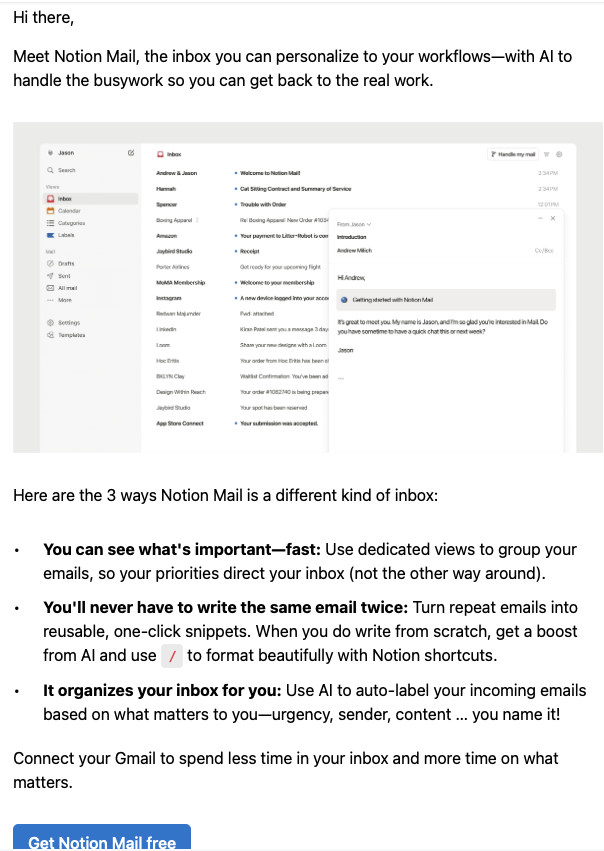

## 시작 페이지
기본적으로는 Gmail를 연동해서 사용해야 한다.
연동 시 구글 계정을 통해 Gmail, Calendar를 연동 하라고 한다. 난 둘다 연동 했다.
추가로 노션 캘린더 처럼 별도의 App으로 만들었다.

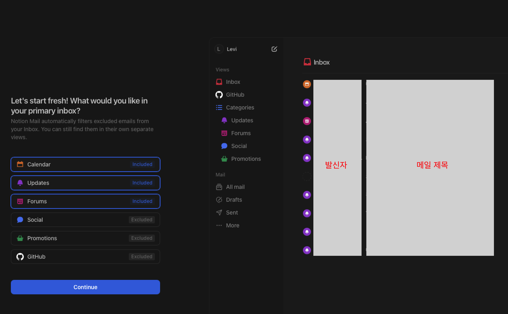

## 사이드 메뉴 구성
1. Views
	- 인박스와 라벨 구분으로 되어 있다. 
	- 카테고리도 있는데, 메일의 라벨 기능을 이용한 기능이다.
  
		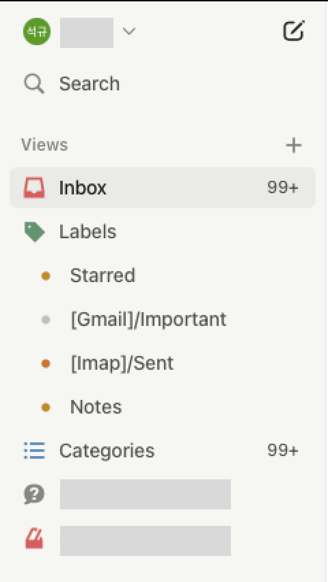

2. Mail
	- 기본적은 메일 보관함과 보낸 메일함이 있다.
  
		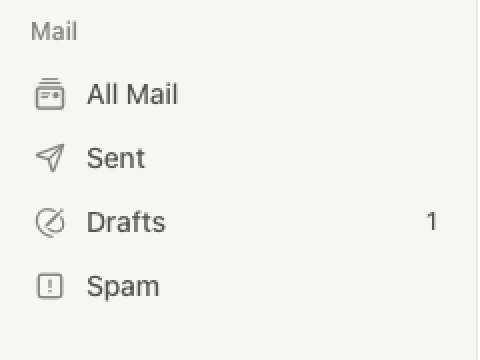

3. 세팅
	- 기본적인 세팅 메뉴가 있다.(언어 변경은 없다)
		
		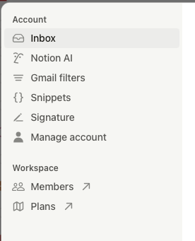

4. 탬플릿
	- 탬플릿은 Views에 대한 탬플릿이 있다. 
	- 다양한 필터값을 세팅해 두었다
  
		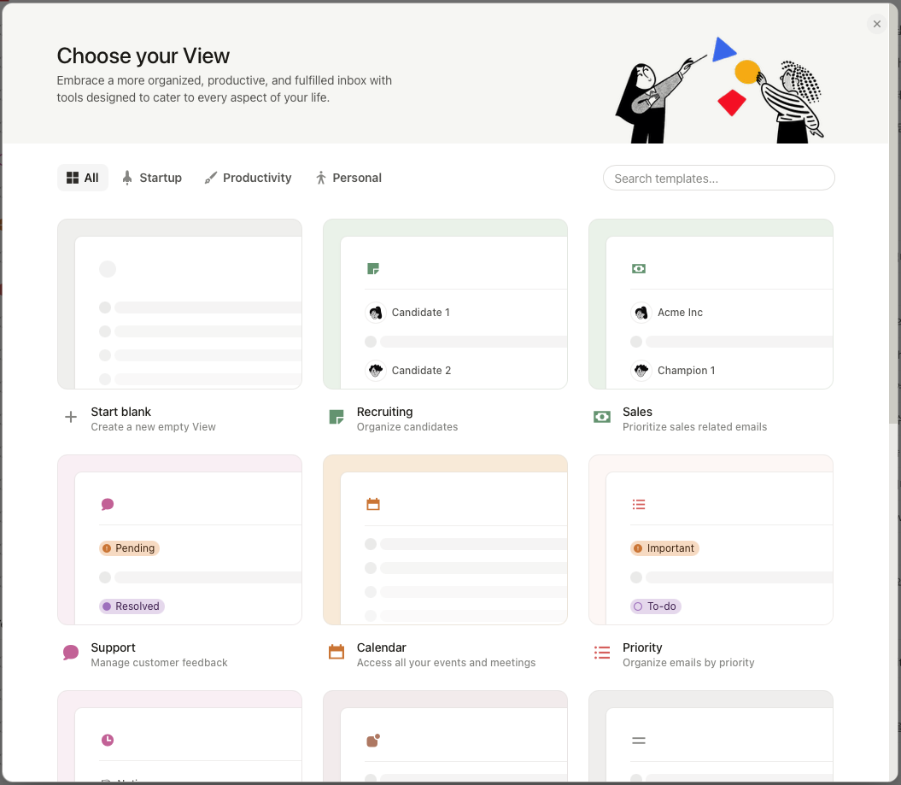

5. 푸터
	- 노션, 노션캘린더로 바로 가는 버튼이 있다
  
		

## 상단 메뉴
라벨, 필터 기타 구분값을 설정 할 수 있는 메뉴가 있다. 

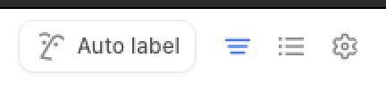

재밌는 건 Group by 에 Priority 라는 구분 항목이 있고, 이를 사용 하면 사이드 바에 하기와 같이 나타난다.

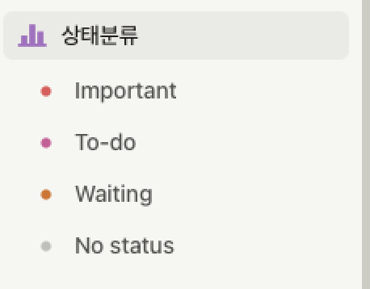

뷰 화면에서는 다음과 같이 보인다
이처럼 메일의 상태값을 분리 하여 관리 할 수 있다.

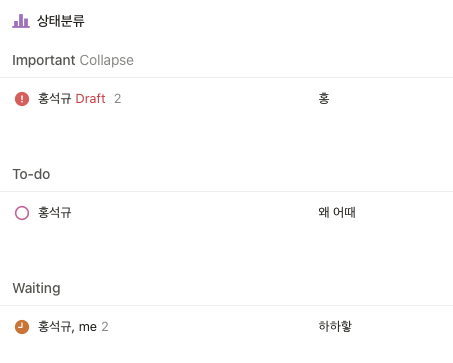

신기한건, Gmail로 가보면,
아래와 같이 라벨이 만들어져 있다. 메일의 라벨 시스템을 극한까지 활용한 모습이다.

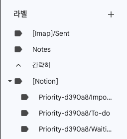

## 메일 작성 화면
메일 에디터에서 노션 문법을 거의 그대로 사용 할 수 있다.
(TODO는 아직 구현이 안된 것 같다...)
캘린더도 연동을 하는데, 이부분은 나중에 디테일하게 활용 해보고 정리하겠다.

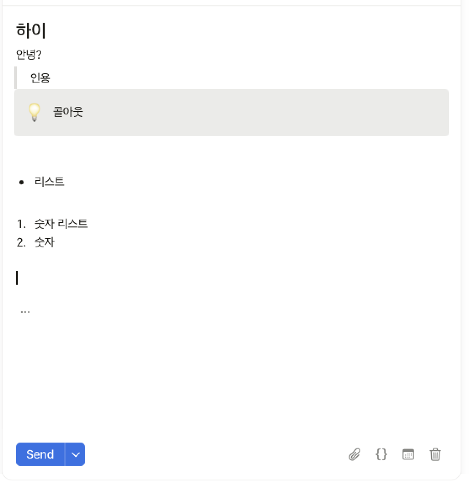

## 결론
캘린더에서 메일까지 만든거 보면, 노션의 방향성이 대략적으로 보이는 것 같다. 
한가지 좀 아쉬웠던건 메일이 구글 메일에만 제약되어 사용이 되는 것 같아서 아쉬웠다. 
아마 장기적으로는 노션 자체 서버를 활용한 이메일이 나올 것 같은데, 그러면 좀더 재밌겠다.
우선 난 회사메일을 Gmail에 연동 하고, 다시 Gmail을 노션 메일에 연동했는데, 진정한 아웃룩(?)처럼 사용 하려면, 노션메일 자체적으로 POP을 지원해야 할 것 같다. 

노션 화이팅.